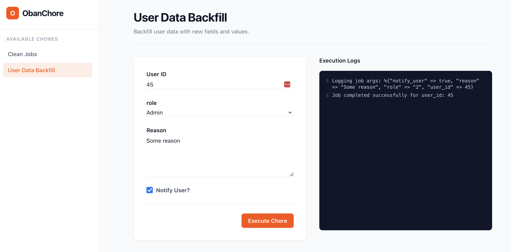

# ObanChore 🎭

**Bridge the gap between robust background processing and safe, manual operational control in Elixir.**

ObanChore is an Elixir library that transforms your standard Oban workers into secure, UI-driven operational tools. It automatically generates a Phoenix LiveView dashboard allowing your team to trigger, monitor, and audit ad-hoc scripts and backfills without touching a production console.



---

## 🛑 The Problem: The "IEx Bottleneck"

In growing applications, developers frequently write ad-hoc scripts: data migrations, one-off backfills, or specific customer support actions (like resetting a stuck billing state or refunding a transaction). 

Historically, executing these scripts involves:
1. A developer SSH-ing into the production server.
2. Opening an `iex -S mix` console.
3. Manually typing execution commands and passing arguments.

**This is risky and unscalable.** Direct production shell access is a security risk, typos in the shell can cause catastrophic data loss, there is zero auditability for compliance, and developers become a permanent bottleneck for Customer Support and Operations teams.

## 💡 The Solution: Democratized Execution

ObanChore solves this by bringing operations out of the terminal and into a secure UI, backed by the resilience of Oban. 

Instead of writing a disposable script, developers write a standard, resilient Oban worker and declare its expected inputs (e.g., `user_id`, `reason`). ObanChore dynamically reads these declarations and **automatically generates a secure Phoenix LiveView interface**.

```elixir
defmodule MyApp.Chores.UserBackfill do
  use ObanChore.Worker,
    name: "User Data Backfill",
    fields: [
      user_id: [type: :integer, required: true, label: "User ID"],
      role: [ type: :select, options: [Admin: 2, Editor: 1, Viewer: 3], prompt: "Choose a role..." ],
      reason: [type: :textarea, required: true, label: "Reason"],
      notify_user: [type: :boolean, label: "Notify User?"]
    ],
    description: "Backfill user data with new fields and values."

  @impl Oban.Worker
  def perform(%Oban.Job{args: %{"user_id" => user_id, "reason" => reason} = args}) do
    notify_user? = Map.get(args, “notify_user”)
    role = Map.get(args, role)
    # Use user_id and reason here
  end
end
```

Support, QA, or Product Managers can now log into an admin dashboard, fill out a user-friendly form, and safely trigger the job—while Oban handles the reliable, asynchronous execution in the background.

## 🚀 Getting Started

### 1. Prerequisites

ObanChore requires a working Phoenix application with **LiveView 1.0+** and **Oban 2.18+** installed and configured.

### 2. Install Dependency

Add `oban_chore` to your `mix.exs`:

```elixir
def deps do
  [
    {:oban_chore, "~> 0.2.0"}
  ]
end
```

### 3. Configure Oban

Add `ObanChore.Plugin` to your Oban configuration:

```elixir
# config/config.exs
config :my_app, Oban,
  repo: MyApp.Repo,
  plugins: [
    {ObanChore.Plugin, otp_app: :my_app},
    # ... other plugins
  ],
  queues: [default: 10]
```

### 4. Define a Chore

Replace `use Oban.Worker` with `use ObanChore.Worker` and define your fields:

```elixir
defmodule MyApp.Chores.UserBackfill do
  use ObanChore.Worker,
    name: "User Data Backfill",
    fields: [
      user_id: [type: :integer, required: true],
      reason: [type: :string, default: "Manual Update"]
    ]

  @impl Oban.Worker
  def perform(%Oban.Job{args: %{"user_id" => user_id, "reason" => reason} = args}) do
    # Your logic here
    :ok
  end

  # Optional: Add custom validations using Ecto.Changeset
  @impl ObanChore.Worker
  def custom_changeset(changeset) do
    changeset
    |> Ecto.Changeset.validate_number(:user_id, greater_than: 0)
    |> Ecto.Changeset.validate_length(:reason, min: 5)
  end
end
```

### 5. Mount the Dashboard

Add the dashboard to your Phoenix router:

```elixir
# lib/my_app_web/router.ex
defmodule MyAppWeb.Router do
  use MyAppWeb, :router
  import ObanChore.Router

  scope "/" do
    pipe_through :browser

    # Mount the dashboard at any path
    oban_chore_dashboard "/chores"
  end
end
```

---

## 🛠️ Field Configuration

### Supported Types

ObanChore supports several field types that automatically map to both Ecto types for validation and HTML input types for the dashboard:

| Type | Ecto Type | HTML Input |
| :--- | :--- | :--- |
| `:string` | `:string` | `text` |
| `:integer` | `:integer` | `number` |
| `:float` | `:float` | `number` |
| `:boolean` | `:boolean` | `checkbox` |
| `:date` | `:date` | `date` |
| `:time` | `:time` | `time` |
| `:utc_datetime` | `:utc_datetime` | `datetime-local` |
| `:textarea` | `:string` | `textarea` |
| `:select` | `:string` | `select` |
| `:checkbox` | `:boolean` | `checkbox` |

### Field Options

Each field can be customized with the following options:

| Option | Description |
| :--- | :--- |
| `:type` | **(Required)** The field type from the table above. |
| `:label` | The display name for the field in the UI. Defaults to the key name. |
| `:required` | Whether the field must be present. Adds validation to the form. |
| `:default` | The initial value for the field in the form. |
| `:options` | Required for `:select`. A list of strings or `{"Label", "Value"}` tuples. |
| `:prompt` | Optional for `:select`. The placeholder text for the dropdown. |

### ⚠️ A Note on Dates and Times

ObanChore fully supports `:date`, `:time`, and `:utc_datetime` fields. Using these types provides a great UI experience, rendering native HTML5 date/time pickers in the dashboard and utilizing Ecto to validate the input.

**However, be aware of Oban's JSON serialization.** Because Oban stores all job arguments in a PostgreSQL `jsonb` column, your worker's `perform/1` function will receive these values as **ISO8601 Strings**, not native Elixir structs. 

If you need to manipulate the date inside your worker, you must parse the string first:

```elixir
defmodule MyApp.Chores.ScheduleReport do
  use ObanChore.Worker, fields: [run_date: [type: :date]]

  @impl Oban.Worker
  def perform(%Oban.Job{args: %{"run_date" => date_string}}) do
    # date_string will be "2026-05-15"
    parsed_date = Date.from_iso8601!(date_string)

    # ... your business logic ...
    :ok
  end
end
```

---

## ⚙️ Advanced Configuration

Since `ObanChore.Worker` is a wrapper around `Oban.Worker`, you can use all standard Oban options:

```elixir
defmodule MyApp.Chores.CriticalBackfill do
  use ObanChore.Worker,
    name: "Critical Data Backfill",
    queue: :operational,        # Run in a specific queue
    max_attempts: 5,            # Set custom retry limit
    priority: 1,                # Set job priority
    fields: [
      user_id: [type: :integer, required: true]
    ]

  @impl Oban.Worker
  def perform(%Oban.Job{args: args}) do
    # ...
  end
end
```

### Real-Time Logging (Optional)

To enable real-time updates from your workers, first configure your PubSub server:

```elixir
# config/config.exs
config :oban_chore, pubsub_server: MyApp.PubSub
```

Then, use `ObanChore.log/2` inside your worker's `perform/1` function to stream updates:

```elixir
defmodule MyApp.Chores.UserBackfill do
  use ObanChore.Worker, name: "User Backfill"

  @impl Oban.Worker
  def perform(%Oban.Job{} = job) do
    ObanChore.log(job, "Starting backfill...")
    # ... logic ...
    ObanChore.log(job, "Processed 50%...")
    # ... logic ...
    ObanChore.log(job, "Done!")
    :ok
  end
end
```

## ✨ Core Features

* 🛠️ **Zero-Boilerplate Internal Tooling:** Stop building custom HTML forms and controllers for one-off admin tasks. Define your argument schema once in the backend, and let ObanChore generate the UI.
* 📡 **Live Execution Streaming:** Leveraging Phoenix PubSub, ObanChore streams logs and progress updates from the isolated background process directly back to the user's browser in real-time.
* 🔐 **Operational Safety by Default:** Move away from direct database manipulation. Chores run within the strict, idempotent boundaries of your Oban workers. 
* 🚦 **Concurrency Control:** Prevent race conditions by ensuring specific operational tasks cannot be triggered concurrently by multiple users.

## 🏗️ Architectural Philosophy

ObanChore is **not** a replacement for Oban. It is a complementary operational layer. 

While Oban excels at automated, system-driven tasks (sending emails, processing webhooks), ObanChore provides the missing interface for **human-driven** tasks. By piggybacking on your existing Oban supervision tree and PostgreSQL queues, ObanChore requires minimal infrastructure overhead while delivering massive operational value.

## 🎯 Who is this for?

* **Engineering Teams:** Looking to reduce interruptions from operational requests and eliminate the need for production IEx access.
* **Customer Support & Ops:** Needing safe, self-serve access to resolve customer issues without waiting on engineering.
* **Technical Founders:** Wanting to implement enterprise-grade compliance, audit logging, and secure internal tooling from day one.
